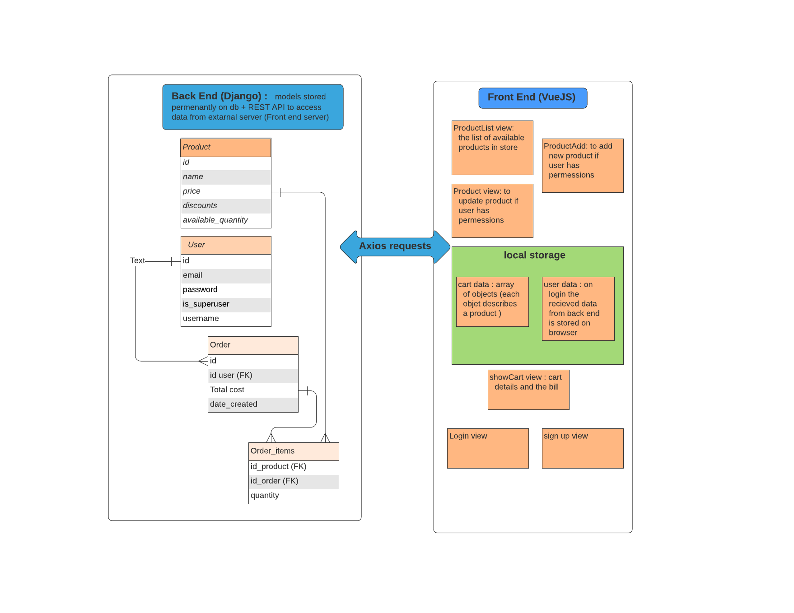

# Supermarket management App (backend)
## App description :
* This is the backend of a supermarket management App build using Django 
*  This image describes the flow of data in the enture app (front and back end):  

## Project setup
Firstly, clone this repository to the current directory:
```
git clone https://github.com/HananeOB/DjangoRESTAPISuperMarket .
```
Next, set up a virtual environment and activate it, then, install required packages:
````
pip install -r requirement.txt
````
Configure your database then perform migrations:
```
python manage.py makemigrations 
```
```
python manage.py migrate
```
The setup is complete. Run a local server with
```
python manage.py runserver 
```
The server should be listenning on localhost:8000.
